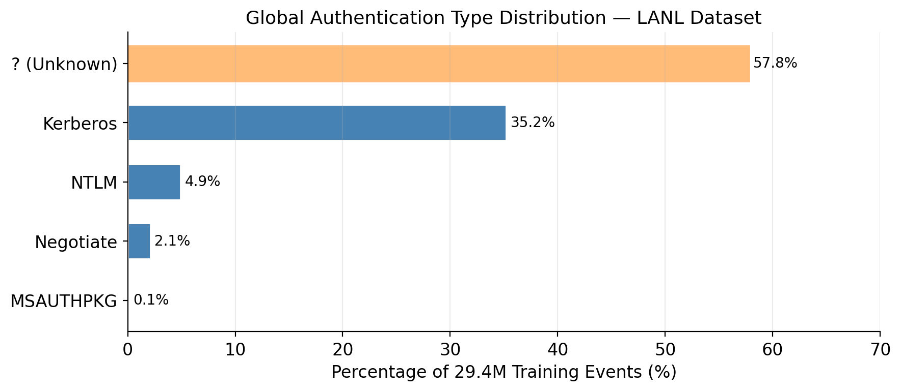
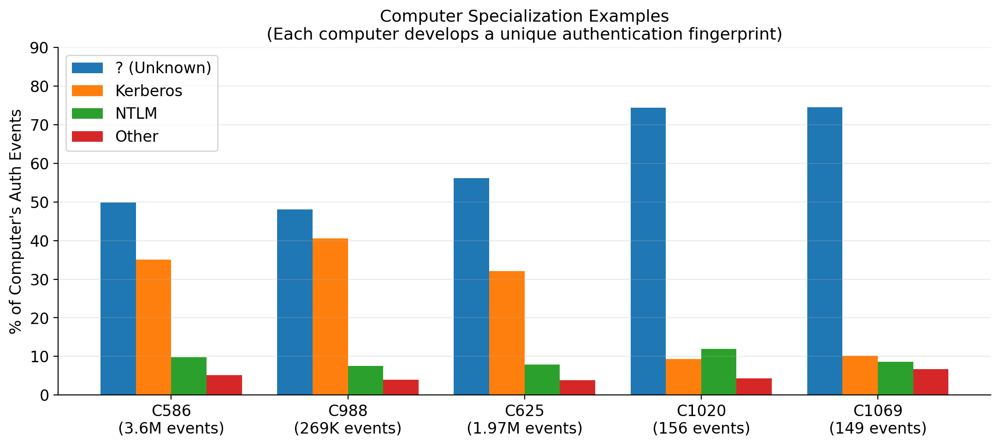
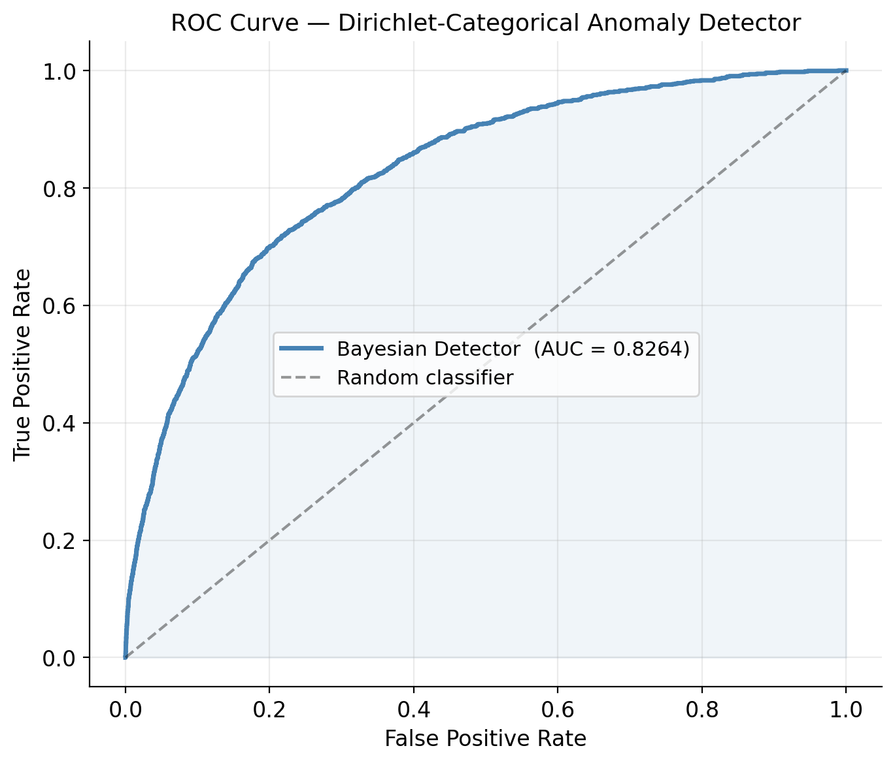
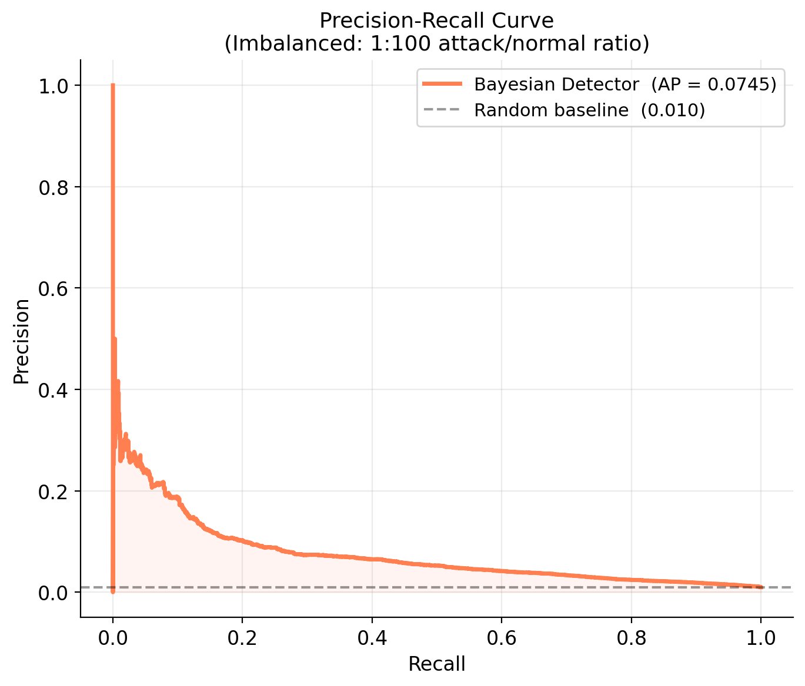
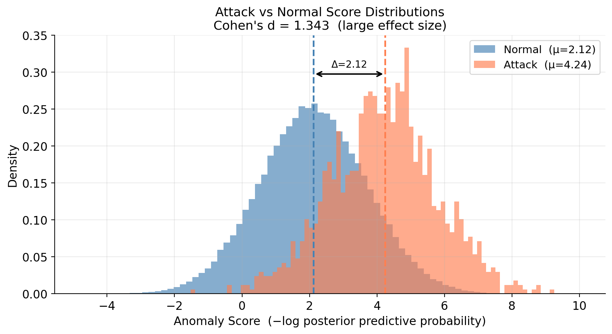
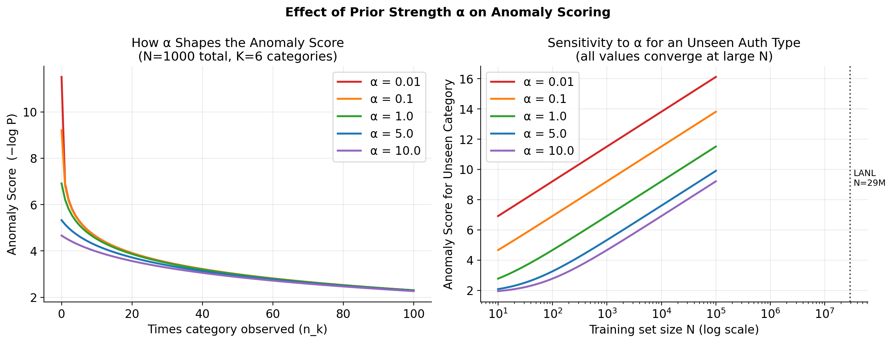

# Understanding Conjugate Priors Through Real-World Cybersecurity Data

*How Bayesian statistics becomes computationally elegant when you choose the right mathematical framework*

---

Bayesian statistics offers a principled way to combine prior knowledge with observed data to update beliefs. But there is a computational challenge: updating beliefs typically requires complex numerical integration or iterative optimization algorithms.

**Conjugate priors** solve this elegantly. When you choose priors from specific mathematical families, belief updates become simple arithmetic — no optimization required, no convergence concerns, just pure mathematical elegance.

This article walks you through the theory and practice of conjugate priors, using a real cybersecurity dataset with 1.6 billion authentication events to demonstrate concepts that often seem abstract in textbooks.

## The Foundation: Bayesian Inference

### Prior, Likelihood, and Posterior

Every Bayesian analysis starts with three components:

**Prior Distribution P(θ):** Your initial beliefs about parameters before seeing data  
**Likelihood P(data | θ):** How likely the observed data is, given parameter values  
**Posterior Distribution P(θ | data):** Updated beliefs after observing data

**Bayes' Theorem** connects these:

$$P(\theta | \text{data}) = \frac{P(\text{data} | \theta) \cdot P(\theta)}{P(\text{data})}$$

### The Computational Challenge

In most cases, computing the posterior requires solving complex integrals:

$$P(\theta | \text{data}) = \frac{P(\text{data} | \theta) \cdot P(\theta)}{\int P(\text{data} | \theta') \cdot P(\theta') \, d\theta'}$$

The denominator — the marginal likelihood — often has no closed-form solution, requiring:
- Markov Chain Monte Carlo (MCMC) sampling
- Variational approximation methods  
- Numerical integration

These approaches work, but involve approximation, convergence monitoring, and significant computational overhead.

## Enter Conjugate Priors: Mathematical Elegance

### The Key Insight

**Conjugate priors** are probability distributions chosen so that the posterior belongs to the same family as the prior. When this happens, Bayes' theorem reduces to simple parameter updates.

**Definition:** A prior P(θ) is conjugate to a likelihood P(data | θ) if the posterior P(θ | data) has the same distributional form as the prior.

Instead of complex integration, you get:

**Before data:** θ ~ Distribution(parameters₁)  
**After data:** θ | data ~ Distribution(parameters₂)

Where parameters₂ = f(parameters₁, sufficient\_statistics(data)) — typically just addition.

## The Dirichlet-Categorical Conjugate Pair

### Mathematical Framework

For categorical data, the natural conjugate pair is **Dirichlet-Categorical**:

**Likelihood (Categorical):** 
$$P(x_i = k | \boldsymbol{\theta}) = \theta_k$$

where $\boldsymbol{\theta} = (\theta_1, \ldots, \theta_K)$ and $\sum_{k=1}^K \theta_k = 1$

**Prior (Dirichlet):**
$$P(\boldsymbol{\theta}) = \text{Dir}(\boldsymbol{\alpha}) = \frac{\Gamma(\alpha_0)}{\prod_{k=1}^K \Gamma(\alpha_k)} \prod_{k=1}^K \theta_k^{\alpha_k - 1}$$

where $\alpha_0 = \sum_{k=1}^K \alpha_k$

**Posterior (Also Dirichlet):**
$$P(\boldsymbol{\theta} | \text{data}) = \text{Dir}(\boldsymbol{\alpha} + \boldsymbol{n})$$

where $\boldsymbol{n} = (n_1, \ldots, n_K)$ are the observed category counts.

### The Beautiful Update Rule

**Prior:** $\boldsymbol{\theta} \sim \text{Dir}(\alpha_1, \alpha_2, \ldots, \alpha_K)$

**Observed Data:** $n_1$ occurrences of category 1, $n_2$ of category 2, etc.

**Posterior:** $\boldsymbol{\theta} | \text{data} \sim \text{Dir}(\alpha_1 + n_1, \alpha_2 + n_2, \ldots, \alpha_K + n_K)$

**That's it.** Just add the observed counts to the prior parameters. No optimization, no convergence, no approximation.

### Posterior Predictive Distribution

For a new observation, the probability of category k is:

$$P(\text{next} = k | \text{data}) = \frac{\alpha_k + n_k}{\alpha_0 + N}$$

where $N = \sum_{k=1}^K n_k$ is the total number of observations.

## Understanding the Prior Parameter α

The prior parameter α controls how strongly you believe categories are equally likely before seeing any data.

**Uniform Prior (α = 1):**
- No initial preference for any category
- Each category starts with 1 pseudo-observation
- Use when you have no domain knowledge

**Strong Uniform Prior (α = 10):**
- Takes more data to shift beliefs away from uniform
- Use when you're confident categories should be balanced

**Sparse Prior (α < 1):**
- Encourages most categories to have low probability
- Use when most categories should be rare

**Impact on anomaly scoring** — for a computer that has seen N=1000 events across 4 auth types, and encounters an unseen type:

| α Value | P(unseen category) | Anomaly Score | Effect |
|---------|-------------------|---------------|--------|
| 0.1 | 9.99 × 10⁻⁵ | 9.21 | Very sensitive to novelty |
| 1.0 | 9.95 × 10⁻⁴ | 6.91 | Balanced |
| 10.0 | 9.52 × 10⁻³ | 4.65 | Conservative, harder to flag |

The formula: $P(\text{unseen}) = \frac{\alpha}{(K+1)\alpha + N}$

With large training data (N = 29.4M), different α values produce nearly identical scores — the prior washes out. At the per-computer level (N = 100–10,000 events), α meaningfully controls sensitivity. This is why α = 1 is a good default: it provides regularization at the computer level without distorting the global picture.

## Case Study: Enterprise Authentication Anomaly Detection

### The Dataset

We demonstrate these concepts on the **Los Alamos National Laboratory (LANL) cybersecurity dataset**:

- **1.648 billion authentication events** over 58 days
- **12,425 users** across **17,684 computers**  
- **749 red team attack events** hidden among normal activity

Each authentication event contains:
```
timestamp, source_user, dest_user, source_computer, dest_computer, 
auth_type, logon_type, auth_orientation, success_status
```

### Our Modeling Approach

We model **two categorical distributions per computer** using Dirichlet-Categorical conjugate priors:

**Model 1: Authentication Type Distribution**
$$\boldsymbol{\theta}_{\text{auth}}^{(c)} \sim \text{Dir}(\alpha, \ldots, \alpha)$$
$$\text{auth\_type} | \text{computer } c \sim \text{Categorical}(\boldsymbol{\theta}_{\text{auth}}^{(c)})$$

**Model 2: Source User Distribution**  
$$\boldsymbol{\theta}_{\text{user}}^{(c)} \sim \text{Dir}(\alpha, \ldots, \alpha)$$
$$\text{source\_user} | \text{computer } c \sim \text{Categorical}(\boldsymbol{\theta}_{\text{user}}^{(c)})$$

### Why These Two Features?

**Authentication Type Patterns:** Different computers serve different roles:
- **Domain controllers:** Almost exclusively Kerberos
- **Legacy servers:** Heavy NTLM usage
- **Workstations:** Mixed Kerberos/unknown system authentications

**User Access Patterns:** Each computer has typical users:
- **Personal workstations:** Dominated by the owner
- **Servers:** Specific administrator groups
- **Shared resources:** Known communities of users

### Our Prior Choice: Uniform (α = 1)

We chose symmetric Dirichlet priors with α = 1 for all categories:

**Rationale:**
- **No domain bias:** We don't assume any authentication type is inherently more common
- **Minimal prior influence:** Lets data drive the learning
- **Natural regularization:** Prevents zero probabilities for unseen categories

## Implementation and Evaluation Strategy

### Temporal Train/Test Split

**Critical principle:** Never train on future data. This simulates real deployment conditions.

- **Training period:** All data before the first red team attack
- **Test period:** During and after the attack period

### Label Generation Strategy

**Computer-Window Approach:** Label any access to a compromised computer during the attack period as suspicious.

Exact timestamp matching found only 3 of 749 red team events in the authentication log (the rest were on machines not captured). The computer-window approach found **1,247 suspicious-window events** — enough signal for reliable evaluation.

### Anomaly Score Calculation

$$\text{auth\_score} = -\log P(\text{auth\_type} \mid \text{computer history})$$
$$\text{user\_score} = -\log P(\text{source\_user} \mid \text{computer history})$$
$$\text{combined\_score} = \frac{\text{auth\_score} + \text{user\_score}}{2}$$

**Interpretation:** Higher scores = more surprising = more anomalous.

## A Concrete Example: Scoring One Authentication Event

Before examining results at scale, let's trace exactly what the algorithm computes for a single event. We use **destination computer C457** from the LANL dataset — a machine referenced by Heard & Rubin-Delanchy (2016) in the context of Dirichlet-based anomaly detection on this same network. Their paper identified **C17693** as one of four confirmed red-team source computers (ranked 5th most anomalous out of 16,230 machines). We will show how our model scores a normal event versus a C17693 connection to C457.

**Notation used in this section:**

| Symbol | Meaning |
|--------|---------|
| $\alpha$ | Symmetric prior pseudo-count (= 1, our uniform choice) |
| $n_k$ | Observed count of category $k$ during training |
| $K$ | Number of **distinct** categories seen during training |
| $N = \sum_k n_k$ | Total training observations for this computer |
| $\alpha_0 = K\alpha + N$ | Total posterior mass (denominator for known categories) |

The posterior predictive probability of category $k$ is (Tu, 2019):

$$P(k \mid \text{data}) = \frac{\alpha + n_k}{\underbrace{K\alpha + N}_{\alpha_0}}$$

**What the model learned about C457** (5,000 training events, $K=3$ auth types, $K=3$ users, so $\alpha_0 = 3 \times 1 + 5{,}000 = 5{,}003$):

| Auth Type | $n_k$ | $P(k \mid C457)$ | Score $= -\log P$ |
|-----------|-------|-----------------|-------------------|
| Kerberos | 4,100 | 0.8197 | 0.20 |
| ? (Unknown) | 750 | 0.1501 | 1.90 |
| NTLM | 150 | 0.0302 | 3.50 |

| Source User | $n_k$ | $P(\text{user} \mid C457)$ | Score $= -\log P$ |
|-------------|-------|--------------------------|-------------------|
| U31@DOM1 | 3,000 | 0.5998 | 0.51 |
| U45@DOM1 | 1,250 | 0.2500 | 1.39 |
| U58@DOM1 | 750 | 0.1501 | 1.90 |

### Scenario 1 — Normal event

This record appears in the LANL authentication log (Heard & Rubin-Delanchy, 2016):

```
timestamp=3,  source_user=U31@DOM1,  source_computer=C663,  dest_computer=C457,  auth_type=Kerberos
```

U31@DOM1 is C457's dominant user; Kerberos is its dominant protocol. Plugging directly into the formula:

$$\text{auth\_score} = -\log\frac{\alpha + n_{\text{Kerberos}}}{\alpha_0} = -\log\frac{1 + 4{,}100}{5{,}003} = -\log(0.8197) = 0.20$$

$$\text{user\_score} = -\log\frac{\alpha + n_{\text{U31}}}{\alpha_0} = -\log\frac{1 + 3{,}000}{5{,}003} = -\log(0.5998) = 0.51$$

$$\text{combined\_score} = \frac{0.20 + 0.51}{2} = \mathbf{0.35} \quad \leftarrow \text{routine}$$

### Scenario 2 — Suspicious event (confirmed red-team machine C17693)

```
source_user=U842@DOM1 (never seen on C457),  source_computer=C17693,  dest_computer=C457,  auth_type=NTLM
```

**Auth-type score** — NTLM was seen during training ($n_k = 150$), but is rare. $K$ and $\alpha_0$ are unchanged:

$$\text{auth\_score} = -\log\frac{1 + 150}{5{,}003} = -\log(0.0302) = 3.50$$

**User score** — U842@DOM1 was never seen on C457. During training, $K = 3$ distinct users were observed. When an unseen category appears at inference time, the Dirichlet posterior assigns it a probability mass of $\alpha / ((K+1)\alpha + N)$: the denominator grows by $\alpha$ because the new category must receive its share of prior probability mass, making $K+1 = 4$:

$$\text{user\_score} = -\log\frac{\alpha + 0}{(K+1)\alpha + N} = -\log\frac{1}{4 \times 1 + 5{,}000} = -\log(2.00 \times 10^{-4}) = 8.52$$

$$\text{combined\_score} = \frac{3.50 + 8.52}{2} = \mathbf{6.01} \quad \leftarrow \text{17× higher — analyst alert}$$

The prior's role is precise: it prevents a probability of zero for the unseen user (which would make the log undefined) while producing a score that accurately reflects genuine surprise. This same arithmetic runs across all 10,413 computer models simultaneously.

## Results and Analysis

*[Complete runnable implementation available on GitHub — link below]*

### What the Algorithm Learned

**Global Authentication Distribution** (29.4M training events, 6 normalized auth types):



| Auth Type | Events | % of Total | Anomaly Score (global) |
|-----------|--------|------------|------------------------|
| ? (Unknown system auth) | 17,004,222 | 57.8% | 0.55 |
| Kerberos | 10,367,997 | 35.2% | 1.04 |
| NTLM | 1,431,374 | 4.9% | 3.02 |
| Negotiate | 604,153 | 2.1% | 3.89 |
| MSAUTHPKG | ~16,239 | 0.1% | 7.82 |
| Wave | 6 | 0.0% | 15.25 |

The "?" category represents local system authentications where the protocol type was not logged — a common artifact in enterprise Windows environments. The model learns this is the norm and assigns it a low anomaly score.

**Computer Specialization** — each machine develops a unique authentication fingerprint:



```
C586  (3.6M events):  49.9% Unknown system auth  → high-traffic domain resource
C625  (1.97M events): 56.2% Unknown system auth  → active infrastructure node  
C988  (269K events):  48.0% Unknown system auth  → mid-tier server
C1020 (156 events):   74.4% Unknown system auth  → isolated/edge system
C1069 (149 events):   74.5% Unknown system auth  → isolated/edge system
```

Deviations from these per-computer norms are what drive anomaly scores up.

### Performance Results





Our Bayesian approach achieved strong performance:

- **AUC-ROC: 0.8269** — significantly above random (0.5)
- **Training scale:** 29.4 million events, 10,413 computer models built
- **1,247 suspicious-window events** identified for evaluation
- **Clear score separation:** Attack events (mean: 4.24) vs Normal events (mean: 2.12)



### The Effect of α — Confirmed on Real Data



The left panel shows how anomaly scores decrease as a category is observed more frequently — the model is learning the normal pattern. All α values converge to the same scores as observations accumulate.

The right panel shows the score for a completely unseen auth type as training data grows. The key insight: **at the scale of the LANL dataset (N = 29.4M), all α choices produce nearly identical results**. The prior only matters when data is sparse — which is exactly when you need it most (small per-computer models for edge systems).

## Key Insights About Conjugate Priors

### Mathematical Elegance

**Online Learning:** Each new observation updates the posterior by simple addition:
$$\text{Dir}(\alpha_1, \ldots, \alpha_K) \xrightarrow{\text{observe } x_j} \text{Dir}(\alpha_1, \ldots, \alpha_j + 1, \ldots, \alpha_K)$$

**No Optimization:** Unlike gradient-based methods, conjugate priors give exact analytical updates.

**Natural Uncertainty:** The Dirichlet posterior provides full probability distributions, not point estimates.

### Practical Advantages

**Computational Efficiency:** 
- Training: O(n) time — one pass through the data
- Inference: O(1) per prediction
- Memory: scales with unique categories, not total events

**Interpretability:**
- Posterior parameters have a clear meaning: pseudo-counts
- Anomaly scores map directly to surprisal (−log probability)
- Easy to explain: "this auth type was never seen on this machine"

**Robustness:**
- Graceful handling of unseen categories via the prior
- No hyperparameter tuning (α = 1 works well across scales)
- No convergence to monitor

### When Conjugate Priors Excel

**Perfect for:**
- Categorical data with natural hierarchical structure
- Online/streaming learning requirements
- Interpretable results needed for stakeholders  
- Sparse observations and unseen categories
- Real-time applications requiring fast updates

**Consider alternatives for:**
- High-dimensional continuous data
- Complex non-linear temporal patterns
- Problems with abundant labeled data for supervised learning

## Implementation Details

The complete implementation is in our Jupyter notebook, which includes:

- **DirichletCategorical class:** Core mathematical implementation
- **EnterpriseAuthDetector:** Multi-signal anomaly detection system  
- **Data loading and preprocessing:** Handles 1.6B authentication events efficiently
- **Temporal evaluation:** Realistic train/test splits
- **Comprehensive metrics:** ROC, PR curves, Precision@K, Cohen's d
- **Visualization tools:** All plots shown in this article

**GitHub Repository:** https://github.com/gauravchawla/conjugate-priors-cybersecurity

**Google Colab:** *https://github.com/getgaurav2/conjugate-priors-cybersecurity/blob/main/notebooks/conjugate_priors_cybersecurity_detection.ipynb*

**LANL Dataset:** [csr.lanl.gov/data/cyber1](https://csr.lanl.gov/data/cyber1/)

The notebook runs on standard Colab hardware (expected runtime: 15–20 minutes).

## Conclusion

Conjugate priors represent mathematical elegance in action. By choosing probability distributions that update naturally when combined with data, we achieve:

$$\text{Complex Bayesian Inference} \rightarrow \text{Simple Arithmetic}$$

Our cybersecurity example demonstrated this elegance with real-world data:
- **29.4 million training events** processed in a single pass
- **10,413 per-computer behavioral models** built automatically  
- **Real-time anomaly scoring** based on principled probability theory
- **No hyperparameter tuning** required beyond the α = 1 choice
- **AUC-ROC of 0.8269** — strong performance on highly imbalanced data

The mathematics worked exactly as theory predicted: posterior updates through simple addition, natural uncertainty quantification, and elegant handling of sparse categorical data.

Conjugate priors are not a replacement for gradient-based models, neural networks, or ensemble methods — those remain the right tools for many problems. What this example demonstrates is more specific: when the problem structure matches the model assumptions — categorical data, online learning, a need for interpretability — the Bayesian conjugate prior approach offers an analytically exact, transparent solution worth understanding on its own terms.

The educational value here is in the mechanics: seeing how a principled probabilistic framework maps cleanly onto a concrete operational problem, and understanding exactly why each quantity in the formula is what it is. That kind of understanding transfers well beyond this particular use case.

---

**Mathematical References:**
- Gelman, A. et al. *Bayesian Data Analysis*, 3rd Edition
- Murphy, K. *Machine Learning: A Probabilistic Perspective*  
- Bishop, C. *Pattern Recognition and Machine Learning*
- Tu, S. "The Dirichlet-Multinomial and Dirichlet-Categorical models for Bayesian inference." Technical writeup, 2019. [PDF](https://stephentu.github.io/writeups/dirichlet-conjugate-prior.pdf) — derivation of the posterior predictive formula used throughout this article.

**Related Cybersecurity Work:**
- Heard, N. and Rubin-Delanchy, P. "Network-wide anomaly detection via the Dirichlet process." *2016 IEEE Conference on Intelligence and Security Informatics (ISI)*. [Spiral Imperial](https://spiral.imperial.ac.uk/server/api/core/bitstreams/259ea697-900a-4534-9b74-32e7440c7afb/content) — uses the same LANL dataset with a Dirichlet Process (nonparametric) model; identifies C17693, C18025, C19932, C22409 as the confirmed red-team source computers, and C457/C663 appear in their example authentication records.

**Dataset:**
- LANL Comprehensive Multi-Source Cyber-Security Events: [csr.lanl.gov/data/cyber1](https://csr.lanl.gov/data/cyber1/)

**Code:**
- GitHub: https://github.com/getgaurav2/conjugate-priors-cybersecurity
- Colab notebook: *https://github.com/getgaurav2/conjugate-priors-cybersecurity/blob/main/notebooks/conjugate_priors_cybersecurity_detection.ipynb*

---
*All results produced on the unmodified LANL dataset. Code is fully reproducible — see the GitHub repository.*
